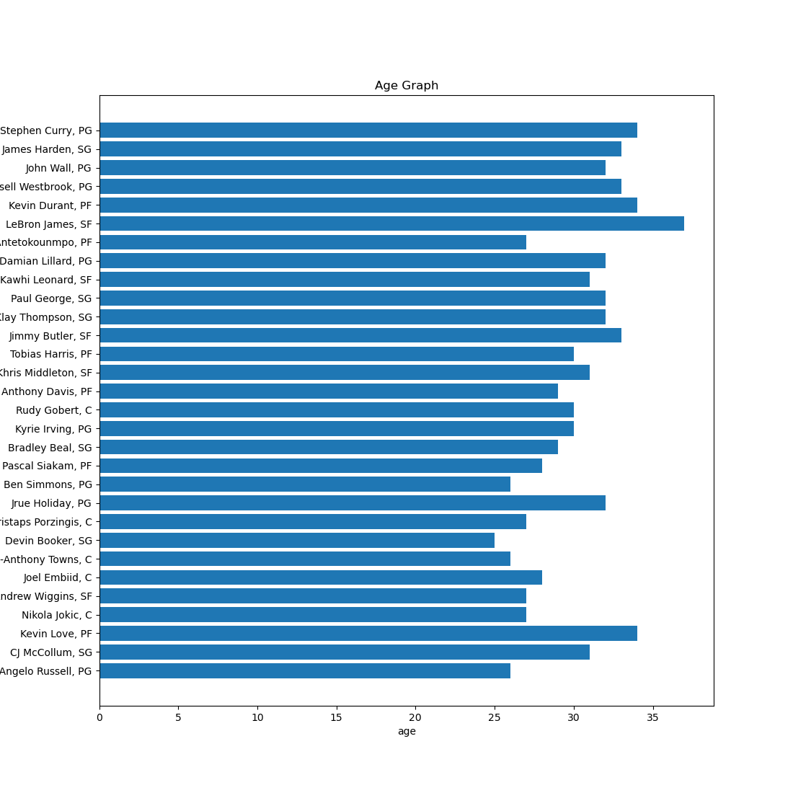
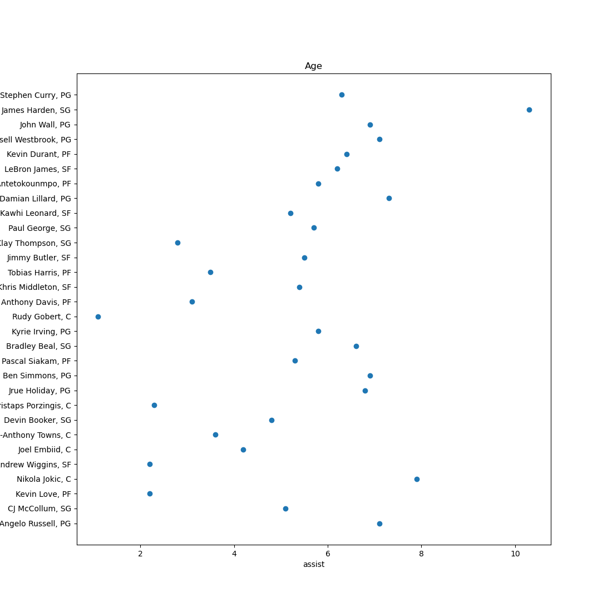
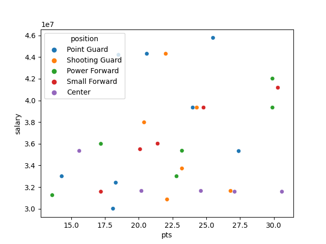

# Group 2 Midterm Project Report

## Goal

The main goal of our analysis is three-folds. One is to scrape data of the top 30 NBA players that earned the highest salary during 2021-2022 season from the ESPN website. Second, we use the data we extracted to see if there are any interesting findings/trends between different variables, such as age, assists per game, points scored per game, height and weight. Lastly, we run a regression analysis to see if there are any correlation between salary and the said variables.

## Data

### Sources

We collected data from the ESPN website in the following order:

1. Ranking of the NBA players' salaries 
	http://www.espn.com/nba/salaries/_/year/2022/seasontype/1

2. Bio pages of individual NBA players' detailed inforamtion.	
	For example, Stephen Curry's detailed information can be found below:
	https://www.espn.com/nba/player/bio/_/id/3975/stephen-curry

### Collection Methods

Our collection methods can be divided into three main steps.
Note: You only need to execute *main.py*, which will run below three steps.

1. Collect the ranking of the NBA players salaries for each player [scrape_ranking.py/scrape_ranking_pages.py]
	- Using request package, we got the html data from the page of ranking of salaries 2021-2022
	  For example, http://www.espn.com/nba/salaries/_/year/2022/seasontype/1
	- Using beatuiful soup package, we got *ranking, name, team, salarly, the link of player's detailed*
	- Also, from the player's link, we got players' *id* which was given by ESPN website. This will be used to merge data later. 
	- We extract only top 30 players in salary from these data.
	- Finally, we created CSV.file named **results_players.csv** that contains these data.

2. Collect each player's detailed information from each bio pages [scrape_player.py/scrape_player_pages.py]
	- Using request package, we got the html data from each player's site
	  For example, https://www.espn.com/nba/player/_/id/3975/stephen-curry
	- Using beautiful soup package, we got *name, position, height, weight, age, assist, pts*
	- Similar to step 1, we got players' *id* from the player's link, which was given by the ESPN website. 
	- Finally, we created CSV.file named **results_player.csv**

3. Merge the ranking data and detailed player's data [main.py]
	- After steps 1 and 2, we read csv files **results_players.csv** and **results_players.csv**.
	- We set *id* as the index for both of the datasets and merged them.
	- Finally, we created CSV.file named **results_integrated.csv** from the merged data.

Note: We used pandas package to handle the datasets more easily.

## Analysis

### Methodology

After scraping all the data, we used matplotlib and seaborn to visualize them. We used a mix of bar graphs and scatter plots with chosen variables. We wanted to see if there are any interesting trends that could be observed.

### Description and Findings

- Plot 1 - Salary
	

	Plot 1 simply shows the top 30 earners in the descending order. We can see that most players in the top 10 are point guards (PG). The average salary is around $36m. In the 20-30 range, most players are centers. Those that have similar salaries have similar contract lengths. For example, Andrew Wiggins and Joel Embiid both have five-year contracts.

- Plot 2 - Salary and Age
	

	Among the top 30, we can see that only Lebron James is older than 36. Most players are between age 30-34. It seems like 35+ may have hard time maintainig high salary, perhaps because they have shorter contracts as they get older.

- Plot 3 - Salary and Assists per Game
	

	We can see that most of the top 30 players have 5+ assists. James Harden has 10+ assists, while Rudy Gobert only has one.

- Plot 4 - Salary and Points per Game by Position
	
	
	From this scatter plot, we observe that more points per game does not necessarily mean higher salary. Also, all of the shooting guards in the top 30 scored more than 20 points per game.

- Regression and Heteroskedasticity Test
	
	We loaded the scraped data using pandas DataFrame. Using sklearn package, we fit a regression model with salary as the response variable and height, weight, age, assists, and points as the five predictor variables. We then used the statsmodels package to perform White's test to determine if heteroskedasticity is present in the regression model. Finally, we generated the results in json file.

	

### Limitations

Players in their first season will lack performance data compared to those who played longer seasons. Incomplete data may have been obtained for such players. Salary is often based on contract length. Star players that have longer contracts will inevitabily have higher salaries. Also, both assists and points per game somewhat depends on the players' position. For example, point guards and shooting guards will have more assists and points than centers and power forwards. Every team has a different salary cap as well. As such, there may be inherent limitations on salary based on the teams and positions.

### Extensions

We could collect larger sample size (100 instead of 30) as well as over longer period of time (multiple seasons instead of one). To strengthen our regression analysis, we could also add more variables such as race, turnover rates, steals, blocks, rebounds, etc. To account for some of the salary limitation mentioned above, we could analayze salary by team and position, which will yield stronger and more accurate comparison.

### Reproducibility

- Set the current directory to the top of the repo (same place where this README.md is located).
- Before executing the code, install requirement.txt or packages if you do not have them already, by running "pip3 install -r requirements.txt" 
- Open the **main.py** under the directory of the code and execute it.
	(main.py executes these python files automatically: 1. scraping_ranking, 2. scrape_rankig_pages, 3. scraping_player, 4. scraping_player_pages)
- After running the above code, you can get three csv files in the artifacts directory.
- **result_integrated.csv** is the final result file that contains all the data.
- Run **excute_plots.py** to generate all the plots that were used in our analysis.
- Run **Heteroscedasticity_Test.py** to execute both the regression analysis and heteroskedasticity testing and produce results in json file.

